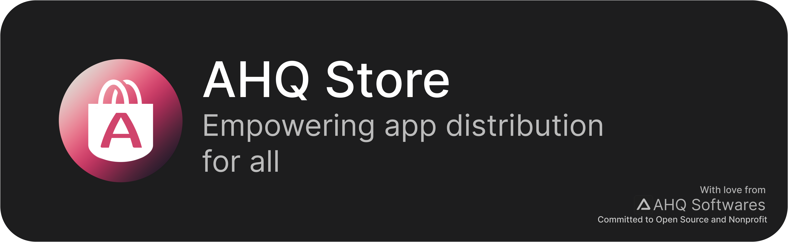

[ References](#references)

# [ AHQ Store](https://ahqstore.github.io)

Empowering app distribution for all

AHQ Store is a **free** and **open sourced** App Store, which allows you to publish apps for **free** and no restrictions[\*](#references)

## Features

- Simple GUI
- Multi-platform
- Free & Open Sourced
- **0 data collection**

## Licensed under MIT

- The software has been provided **as is** without any warnnanty of any kind
- The developer is not responsible for any damages cause by use of this software in any way

# References

- [Terms of Service](https://ahqstore.github.io/tos/index.html)
- [Security Policy](https://github.com/ahqsoftwares/tauri-ahq-store/security/policy)
- [\*](#ahq-store) Your app might be screened by the maintainers AND your app will be scanned by Windows Defender (windows) on every install on every users' computer
